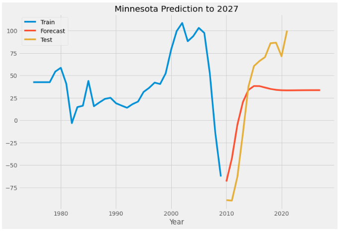

# Cannabis Legality and Effect on Housing Price Index
Student: Joshua Ruggles  
Instructor: Morgan Jones  
Data Science Flex  
Date: 4/26/23   

### Business Problem 
We have been contacted by a real estate agency to see if there is any relation between a bump in housing prices where cannabis has been legalized and if so, when and how much?

We will take into account the year that cannabis was legalized in the state in question and train an ARMA model on the stationary data (if applicable) of states that have legalized cannabis and see if there would be a bump in HPI for homes in states that have yet to do so, if they so choose to legalize.
  
### Cannabis' effect on Housing Market
For this project we are looking at cannabis and its effect on the housing market in states that have legalized recreational use.
  

Image from nbcnews.com (November 2022)
 

## There is data on all 50 states 

  
### Abbreviations explored and why we don't currently need them:
  
- FIPS: FIPS codes are the numbers used to identify geographic 
regions like countries, states and counties.

  
- Annual Change (%): This is great tracking information for our analysis but currently will not work with our model. Also, because our intentions are to visualize this information we can just use HPI against each year to visualize change. 

  
- HPI with 1990 base: The average of the Housing Price Index from the year 1900 to 2000. 

  
- HPI with 2000 base: The average of the Housing Price Index from 2000 to presumably 2022. 

### What we do need:
  
- HPI: Housing price index 
  
The House Price Index (HPI) is a broad measure of the movement of single-family property prices in the United States. Aside from serving as an indicator of house price trends, it also functions as an analytical tool for estimating changes in the rates of mortgage defaults, prepayments, and housing affordability. Generally speaking this is the most important data for our analysis.   
https://www.investopedia.com/terms/h/house-price-index-hpi.asp
 

### What states then have legalized recreational cannabis use? 

 

_According to the National Conference of State Legislatures, 21 states have legalized the adult use of marijuana for recreational purposes: Alaska, Arizona, California, Colorado, Connecticut, Illinois, Maine, Maryland, Massachusetts, Michigan, Missouri, Montana, New Jersey, New Mexico, New York, Nevada, Oregon, Rhode Island, Vermont, Virginia and Washington._  
 
From: https://www.cnet.com/news/politics/marijuana-laws-by-state-where-is-weed-legal/#:~:text=According%20to%20the%20National%20Conference,York%2C%20Nevada%2C%20Oregon%2C%20Rhode
 
For our purposes we will also need to know when each state legalized recreational use of cannabis by year.  

- Alaska: Q4 2014
- Arizona: Q4 2020
- California: Q4 2016
- Colorado: Q4 2012
- Connecticut: Q1 2023
- District of Columbia Q1 2014
- Illinois: Q1 2020
- Maine: Q4 2016
- Maryland: TBD (2023)
- Massachusetts: Q4 2016
- Michigan: Q4 2018
- Missouri: Q4 2022
- Montana: Q1 2021
- New Jersey: Q2 2022
- New Mexico: Q2 2021
- New York: Q1 2021
- Nevada: Q1 2017
- Oregon: Q3 2015
- Rhode Island: Q4 2022
- Vermont: Q4 2022
- Virginia: Q3 2021
- Washington: Q4 2012
 

# Business Suggestion #1: 
There is an implied change in our dataset regarding increased HPI percentage change and cannabis legalization. It is our suggestion to consider investing inside of that space (a state that has legalized recreational cannabis use) the year legislation is passed and to consider selling within 3 - 4 years of acquiring a property. 

* The earliest adopters of legalized recreational cannabis use experienced up to 4 years of HPI percentage change increase that was measured above the national average; _this could be due to other external factors._  
* This data was taken from the first four states to legalize recreational use of cannabis in the following regions:  
    * West Coast: Washington 2012 - 2016 = 2.84% above national average 2012 - 2016  
    * Mountainous West: Colorado 2012 - 2016 = 3.72% above national average  2012 - 2016  
    * East Coast: Maine 2016 - 2020 = 0.57% above national average 2016 - 2020   
    * East Coast: Massachusetts 2016 - 2020 = .06% above national average 2016-2020
    
    
     
 # Business Suggestion #2: 

As of 4/23/23 recreational cannabis use is legal has become legal in Delaware. Our suggestion is to purchase properties, _now_.   

  

Delaware Presidential Election Voting History 
270towin.com (2020)
  

 

While we cannot make any assumptions regarding HPI percentage change or even HPI, we can say that our forecasted prediction and test set report a positive change over the next three years. Our model predicts that in 2022 (not shown in data) the HPI will go up 20.42 points, in 2023 39.38, and in 2024 54.55. Our model has a standard deviation of 14.11. In the year 2025 however it appears that there will be a potential HPI recession.

 

## Delaware Legalizaiton: Successful

According to 'Millions in Revenue Anticipated from Legalizing Marijuana in Delaware', orignally published on January 25, 2021 by Delaware State Auditor Kathy McGuiness, RPh, CFE link: https://auditor.delaware.gov/wp-content/uploads/sites/40/2021/01/Marijuana-Special-Report-FInal-Report-2021.pdf   

In short: Delaware is likely to see a 215 million dollar cannabis industry based on its adult population of 792,119 (2021), an approximated 13 percent use rate in the adult population, with an estimated annual user spending of $2080 

With legalization of recreational cannabis use having been successful this past weekend in Delaware and an understanding that the housing price index (HPI) historically ticks upward during times of legalization, our ultimate suggestion is to invest in Delaware properties, now and consider selling at peak within the next 3 - 4 years.
  

## Business Suggestion #3: 

April 26th, 2023 Minnesota House has passed a bill to legalize recreational cannabis. Though medicinal cannabis has been legal in Minnesota since 2014, we maintain the same business suggestion as before, consider purchasing, now.  

  

# Conclusion

In conclusion, the data suggest that there is in fact a relationship between states that have legalized recreational cannabis and elevated HPI. 
  
It is our suggestion to purchase property in states that have legalized recreational cannabis in the same year that it was announced. 
  
State legislation is constantly changing, we suggest purchasing property prior to federal legalization. 

